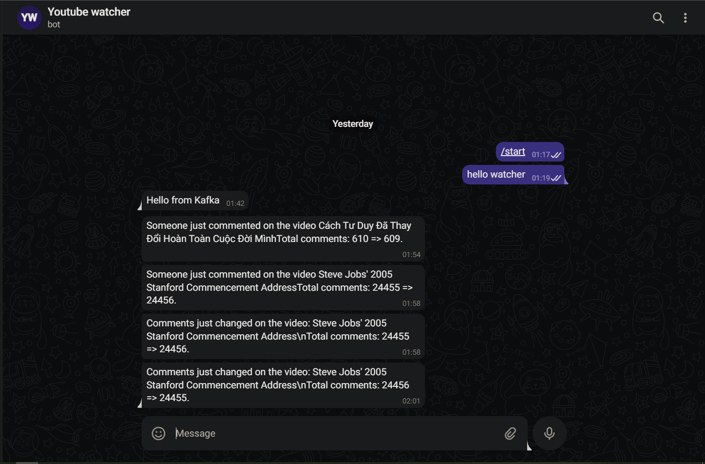

# Youtube playlist watcher - A Reactive Data Streaming App with Python and Apache Kafka

I followed [this tutorial](https://www.youtube.com/watch?v=jItIQ-UvFI4) (I really like the instructor) to practice on Confluent cloud after learning some terms of Apache Kafka.

## Introduction the App

If there's something on the internet you want to keep tabs on and be alerted when it changes, how can we make an app do that work for you? In this case, if a YouTube playlist/video interests me and I want to know if anyone comments on those so I can read and reply ASAP, but the problem is Google doesn't provide us this kind of APIs. This application is one of the solutions. It keeps track of videos and sends the notification to a Telegram bot to inform you.

## How it work?

I think it's better to watch [this tutorial](https://www.youtube.com/watch?v=jItIQ-UvFI4) if you really want to understand the workflow.

## Things I learned from this project

- Set up a Kafka cluster on Confluent cloud.
- Basic configure Kafka client with Python.
- Create a producer to stream data.
- Use Ksql to work with data streams.
- Use Kafka connector to provide data to a Telegram bot."

